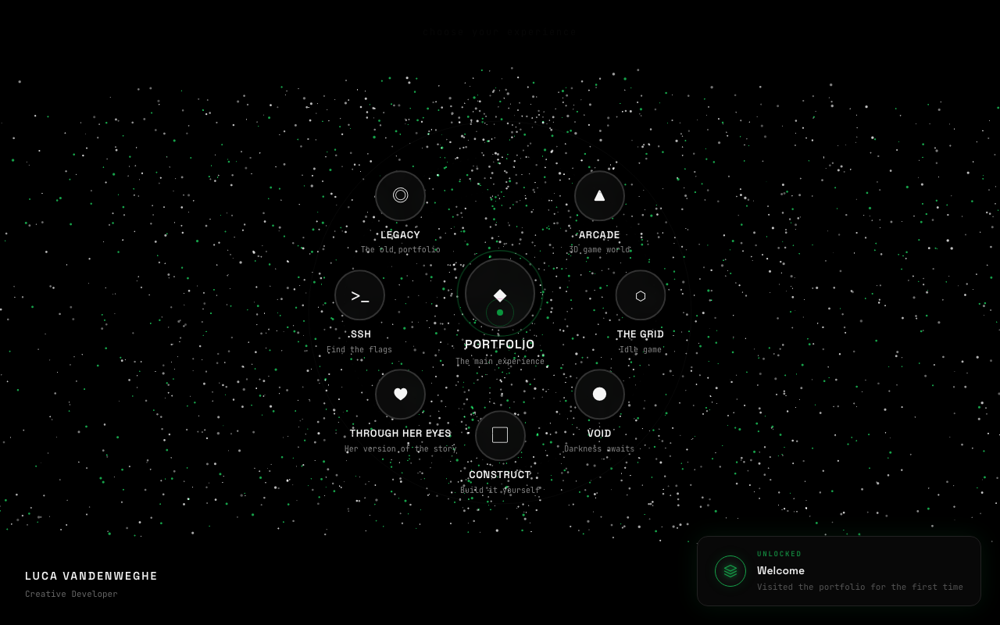

<div align="center">

```
 ██╗     ██╗   ██╗██████╗ ██╗   ██╗    ███████╗ ██████╗ ██╗     ██╗ ██████╗
 ██║     ██║   ██║██╔══██╗██║   ██║    ██╔════╝██╔═══██╗██║     ██║██╔═══██╗
 ██║     ██║   ██║██████╔╝██║   ██║    █████╗  ██║   ██║██║     ██║██║   ██║
 ██║     ██║   ██║██╔══██╗██║   ██║    ██╔══╝  ██║   ██║██║     ██║██║   ██║
 ███████╗╚██████╔╝██████╔╝╚██████╔╝    ██║     ╚██████╔╝███████╗██║╚██████╔╝
 ╚══════╝ ╚═════╝ ╚═════╝  ╚═════╝     ╚═╝      ╚═════╝ ╚══════╝╚═╝ ╚═════╝
```

**Not a portfolio. An experience.**

[Enter the Hub](https://lubu-folio.vercel.app) | [View Source](#project-structure)

</div>



---

## What is this

Seven interconnected worlds disguised as a developer portfolio. Each page is its own self-contained experience with unique mechanics, visuals, and secrets to find. 28+ achievements to unlock, 100+ hidden easter eggs, and a terminal-based CTF with 20 flags to capture.

This is what happens when a developer decides a resume PDF is boring.

---

## The Worlds

### Hub — The Entrance

A particle-driven portal system. 3,000 particles react to your cursor in real time. Eight portals orbit the center, each with unique particle physics — circles pull particles into orbital rings, skulls repel from the eyes and attract at the jaw, spirals create vortex fields. Click anywhere to send a radial shockwave through the particle field.

```
              Portfolio
                 |
    Void ---  [ HUB ]  --- Arcade
       \      / | \      /
     SSH   Grid  Construct  Through Her Eyes
```

### Portfolio — The Showcase

The actual portfolio. Hero, about, projects, experience, and contact — but the skills section is a force-directed constellation rendered on canvas. Skill nodes float on sine waves, color-coded by discipline, connected by graph edges that light up on hover.

### Arcade — 10 Playable Games

A Three.js neon arcade with 10 cabinets arranged in a curved formation. Walk up to a machine, press play.

```
  SNAKE      green    classic grid snake, hi-score threshold at 10
  PONG       blue     two-paddle, first to win
  REFLEX     orange   reaction time under 350ms
  MEMORY     purple   visual simon says, 45-step sequence
  DODGE      pink     avoid incoming projectiles, survive 30 waves
  AIM        cyan     precision clicking, 20+ hits
  SIMON      magenta  color sequence recall, 6+ rounds
  DESCENT    red      fall through obstacles, survive 20 levels
  STRATAGEM  yellow   strategy puzzle, score 30+
  TETRIS     cyan     classic tetris, clear 1000+ points
```

Master all 10 to unlock the Arcade Master achievement. The scene has neon floor grids, fog, and a camera that follows your mouse.

### Grid — Idle Game With 6 Eras

A prestige-based incremental game. Click to generate bits, buy upgrades for passive BPS, then prestige to reset everything for a permanent multiplier. Each prestige evolves the visual era:

```
  Era 1  Boot Sequence   green scanlines, terminal aesthetic
  Era 2  Pipeline         cyan pipes, flow mechanics
  Era 3  Dev Mode         IDE interface, code delivery
  Era 4  Hex Grid         tactical hex-based resources
  Era 5  Final Form       evolution visualization
  Era 6  IDE Stage        full build environment, deploy to production
```

CRT scanlines, monospace type, era-specific neon palettes. Auto-saves every 5 seconds.

### Void — Atmospheric Explorer

A dark canvas. You have a light. Things are hidden in the black — creatures wander, dust drifts, footprints fade behind you. Find what you can.

### SSH — Capture The Flag

```
  luca@portfolio:~$
```

A terminal-based CTF. You get a fake UNIX shell with a real filesystem, working commands, and flags hidden in places you would expect flags to be hidden. Earn privilege levels as you find more. `sudo` is denied.

### Through Her Eyes — Storybook

An intimate, illustrated story with handwritten fonts and warm tones. Navigate pages with arrow keys or drag. Background music shifts per section.

### Construct — Portfolio Builder

A drag-and-drop grid where you build your own portfolio layout. Place 6 required blocks (Hero, About, Projects, Skills, Experience, Contact) plus 20+ decorative blocks. Ghost previews on drag, collision detection, and a confetti explosion when you complete it. Switch to 3D view mode to see your layout rendered in Three.js.

---

## Secrets

There are things hidden in every world. Achievements to unlock, words to type, codes to enter, consoles to open. I am not going to tell you what they are. Explore.

---

## Tech

```
  Astro 5             static generation, file-based routing
  React 19            interactive components
  Three.js            3D scenes (arcade, hub, construct)
  React Three Fiber   React bindings for Three.js
  GSAP                scroll-driven animations
  Tailwind CSS 4      styling
  Zustand             global state + achievement tracking
  Howler.js           sound effects
  Strudel             live-coded music in the arcade
```

---

## Project Structure

```
  src/
    pages/
      index.astro             hub with particle portals
      portfolio.astro         main portfolio
      arcade.astro            10-game 3D arcade
      grid.astro              idle game with 6 eras
      void.astro              dark atmospheric explorer
      ssh.astro               terminal CTF with 20 flags
      through-her-eyes.astro  illustrated storybook
      construct.astro         drag-and-drop builder
    components/
      hub/          particle canvas, portal nodes
      portfolio/    hero, about, projects, skills constellation, timeline
      arcade/       3D scene, 10 game components, cabinet renderer
      grid/         era stages, upgrade system, prestige mechanics
      void/         canvas renderer, lighting modes, creature AI
      ssh/          terminal emulator, filesystem, boot sequence
      storybook/    book shell, page renderer, audio controller
      construct/    build canvas, block dock, 3D view mode
      ui/           cursor, achievements, theme switcher, nav, console
    stores/
      store.js      achievements, section tracking, game state
```

---

## Run Locally

```bash
git clone https://github.com/L-ubu/Lubu-Folio.git
cd Lubu-Folio
npm install
npm run dev
```

Opens at `localhost:4321`.

---

## License

MIT
